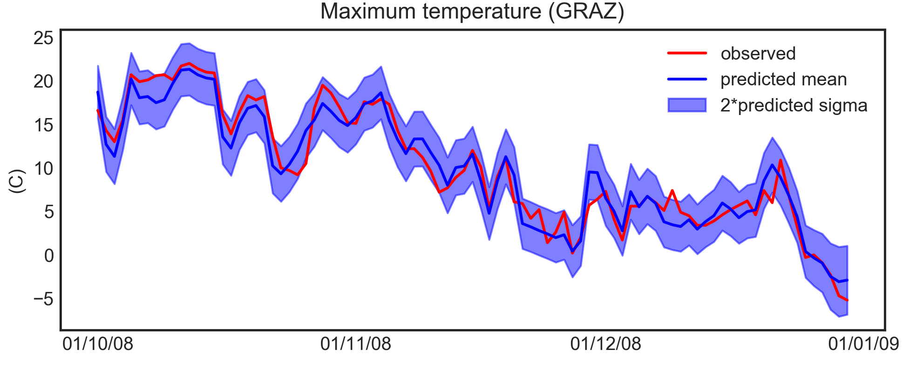

# convCNPClimate
Implementation of convolutional conditional neural processes for statistical downscaling. 

## References
Elements of the code in this implementation were adapted from Yann Dubois' neural process repo (https://yanndubs.github.io). Specifically, these are:
- Parts of the Encoder class, particularly the ProbabilityConverter class for converting the density channel to a probability.
- The implementation of the ResNet decoder architecture, including ResConvBlock and function to make the convolution depth separable were adapted from Yann's work.

All other code is my own work. 

## Models
Source code for different sections of the report can be found in
- Sections 3,5 (marginal distributions): models used in this section are in models/elev_models
- Section 4 (multivariate downscaling): models for predicting p(precipitation|temperature) in models/multivar_models_tmax_init, and for p(temperature|precipitation) models/multivar_models_precip_init

Code for preliminary implementations of models discussed under future work is also included:
- Extension of the precipitation model to a Bernoulli-Gamma-Generalised Pareto mixture distribution is in models/gamma_gp_elev_models
- An alternative to using the MLP for topographic data which instead uses a second convCNP is in elevation_double_convCNP
## Examples
Trained models are included in examples/. The notebooks
- precip_marginal_prediction.ipynb
- tmax_marginal_prediction.ipynb

Demonstrate using the trained models from experiment 3 of the report to make predictions at held out stations
